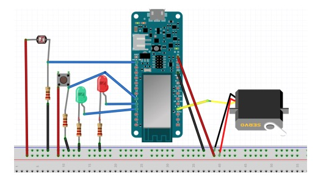

# Project 1

## Task

You have been tasked with creating a light meter that can be easily interpreted by a
user. You are to use the Arduino simulator, a photoresistor (Attached to A0), a servomotor
(Signal from Pin 7), a pushbutton (Input at Pin 0), a red LED (Pin1), and a green LED
(Pin 2) to create a visual interface that describes the current light level in two modes. The
two modes will be switched using the pushbutton.

<!-- Include the image from the location /images/project-1-pinout.jpg -->

## Expected Operation

The light meter will operate in two modes. The first mode is a
standard light gauge, where the servo will manipulate an arm that reads out the approximate
light level. In this mode, the servomotor arm should be all the way to the left when there
is little/no light, and all the way to the right when there is a lot of light. The second mode
is for light sensitive areas, where light above a certain intensity for an extended period of
time is undesirable. In this mode, the servomotor will act as a count-down timer, with the
arm starting all the way to the right, and a green LED should be lit indicating there is no
error. For every second the light is above a certain luminosity, the servomotor will move to
the left. After 30 seconds, the servomotor should be all the way to the left, and a red LED
should light up indicating an error. Switching between modes should reset the counter.

## Tests

1. On boot-up the system blinks both LEDs, then enters mode 1
2. In mode 1, the servomotor arm swings to the right when there is light
3. In mode 1, the servomotor arm swings back to the left when there is no light
4. In mode 1, the button is pressed, and the system enters mode 2
5. On entering mode 2, the servomotor arm moves all the way to the right
6. On entering mode 2, the green LED lights up
7. In mode 2, when light is applied, the servomotor arm ticks left every second
8. In mode 2, when the arm has gone all the way to the left, the Green LED turns off
and Red LED turns on
9. In mode 2, when the pushbutton is pressed, any LEDs should turn off, and the system
should enter mode 1
10. On re-entering mode 2, the counter and any LEDs should be reset (i.e. the green LED
should be lit, the arm should point all the way to the right)

## Walkthrough

1. Setup breadboard per the pinout diagram.
    1. I connected the Leds, servo, photoresistor, and pushbutton to the breadboard.
    2. I connected those components to power and ground with resistors and jumper wires.
    3. I connected the components to the Arduino Uno R3 board, as well as power and ground.
2. Write the code for the project.
    1. I wrote the code for the project in the Arduino IDE.
    2. I used the Arduino IDE to compile and upload the code to the Arduino Uno R3 board.
    3. I started by defining the pins for the LEDs, servo, photoresistor, and pushbutton.
    4. I then defined the variables for the servo position, the light level, and the mode.
    5. I included the servo library, and instantiated the servo object.
        1. I had to use the library import function in the Arduino IDE to include the servo library.
    6. I then wrote the setup function, which sets the pins to output or input, and sets the servo position to 0.
    7. I started implementing mode 1 in the loop function.
        1. Read the photoreistor value and set the light level variable.
        2. I printed out the light level value to the serial monitor to determine the range of values.
        3. I found that the range of values was 40-250, where 40 was the lowest value and 250 was the highest value.
        4. I set the threshold value to be 105, which is the midpoint of the range.

## Challenges

This section is dedicated towards the issues I ran into while working on this project.
